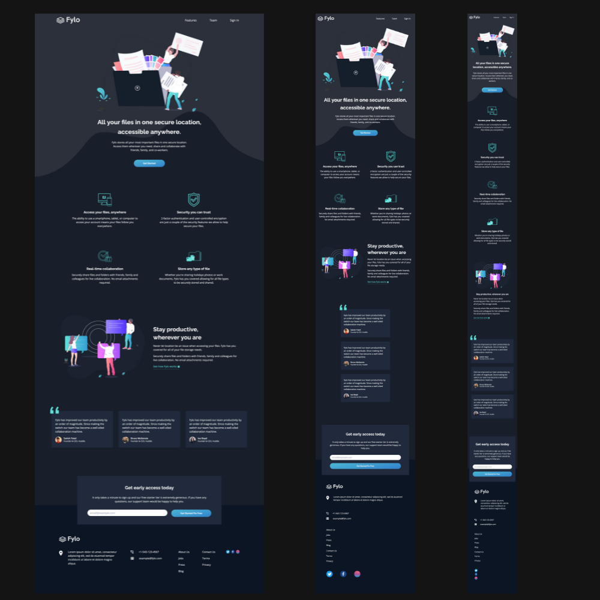

## Table of contents

- [Overview](#overview)
  - [The challenge](#the-challenge)
  - [Screenshot](#screenshot)
  - [Links](#links)
- [My process](#my-process)
  - [Built with](#built-with)
  - [What I learned](#what-i-learned)

**Note: Delete this note and update the table of contents based on what sections you keep.**

## Overview

This was an assignment from FrontEndMentor (https://www.frontendmentor.io/challenges/fylo-dark-theme-landing-page-5ca5f2d21e82137ec91a50fd)

### The challenge

Users should be able to:

- View the optimal layout for the site depending on their device's screen size
- See hover states for all interactive elements on the page

### Screenshot

### Links

- Live Site URL: https://app.netlify.com/sites/whimsical-sfogliatella-15b07f/overview

## My process

I decided to use Astro and Tailwind for this page with a hint of Daisy to quickly implement a responsive navbar. This was my first project with Astro, and I found it fairly easy to get things up and running.

This was also the first project I used polypane on, which is an app that allows you to see your page at different resolutions simultaneously. It's an interesting answer to the mobile or desktop first question, as you can actually design for all major screen sizes simultaneously.

I did make some design decisions that were different from the original style guide. For example, the font in the style guide was 14px, which I believe is far too small to provide a good user experience.

### Built with

- Astro
- React
- Tailwind CSS
- Daisy UI (for the Nav)

### What I learned

Working with SVG's as a background can be difficult when designing for different screen sizes.

Tailwind is great, sometimes I have to add some vanilla CSS to get things looking exactly the way that I want.
